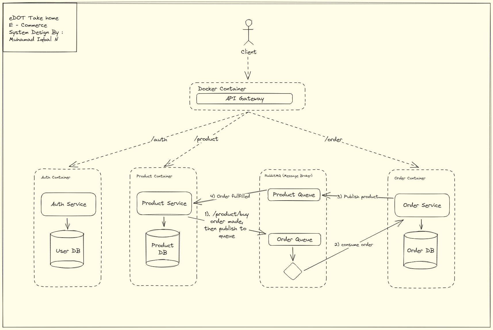

# E-Dot (E-Commerce Backend System)

This backend application is intended to complete the tasks given by E-Dot to continue the hiring process.

## System Design

- The application uses an API gateway to bind all services along a single front, acting as a proxy for the domains in which the `auth`, `order`, and `product` microservices are deployed on
- Each microservice, the API gateway, and RabbitMQ are deployed as Docker images
- Interactions between the `product` service and `order` service uses [AMQP](https://www.amqp.org) protocol, using RabbitMQ which consists of two queues - `orders` and `products`. This saves on resources allocated for REST calls to MongoDB.
- The `product` service publishes to the order queue which is then consumed and collated by the `order` service
- The `order` service publishes ordered products to the product queue which is then consumed by `product` to return order details

## Microservice Structure

- The architecture for a microservice is inspired by the [Clean Architecture](https://www.freecodecamp.org/news/a-quick-introduction-to-clean-architecture-990c014448d2), which supports strong modularity, loose coupling, and dependency injection

Tech Stack: Node.js, Express, MongoDB, Docker, RabbitMQ, Mocha, Chai

## Prerequisites
- Have [npm](https://www.npmjs.com) and [Node.js](https://nodejs.dev/en/) on your machine
- Have [Docker](https://www.docker.com) installed
- Have [RabbitMQ](https://www.rabbitmq.com) installed
- Set up your own [MongoDB](https://www.mongodb.com) collection with appropriate security/credential settings

## Steps to run

### On Docker
1. Create a .env file following the format specified in the `/auth/env.example`, `order/env.example`, and `product/env.example` directories, following the format specified in each microservice directory
2. Run `docker-compose build`
3. Run `docker-compose up`. Now you can test the APIs from localhost:3003

### On localhost
1. Create a .env file following the format specified in the `/auth/env.example`, `order/env.example`, and `product/env.example` directories, following the format specified in each microservice directory
2. Run `npm install` in the `/auth`, `/product`, `/order`, and `/api-gateway` directories
3. Run `npm start` on all four directories mentioned in the step above. Now you can test the APIs from localhost:3003

## Future work and improvements
- It could be useful to use Kubernetes for container orchestration in order to bundle up this project into one cohesive unit
- While I tried to follow a TDD approach - that is, letting test cases guide development - I eventually gave up on it in the name of speedy development. Ideally, I could have written unit tests first, and slowly increment up to integration tests and then system tests.
- The internal service of each microservice does not follow pure dependency injection advocated in Clean Architecture. The internal file structures and flow of dependencies are loosely based on Clean Architecture and the code does not fully utilize dependency injection principles. While I did try to minimize interdependencies, I found it a bit overkill to follow Clean Architecture fully for what is essentially a take-home project. But it is worth trying eventually.
- I'd like to write a series of Bash scripts with various `curl` commands to automate API testing and follow them in a sequence of particular use cases (e.g. user publishes product -> another user logs in -> other user buys product -> ...) 
- It could be a good exercise to deploy the databases across different platforms (e.g. Firebase, SQL, etc.) to prevent a single point of failure
- Since I haven't been able to finish up all the requirements such as the Warehouse and Shop Services, I may need to improve these services to be developed in the future.

## Criticism and Suggestions For The Hiring Process
I think that the hiring process of the e-dot company needs to reconsider the time allocated for us as candidates to complete the tasks given, especially in completing this task, because it is to build, design, and develop backend services for a complete e-commerce and stock management system I can say that in just one day it is an impossible thing that can only be done in one day.

## Conclusion
In developing a backend system for e-commerce, we can separate the modules that we can consider in terms of scaling by using NodeJS and MessageBroker as well as maximizing the system architecture by using The Clean Architecture so that each existing service and module can communicate well, from the task what I received I believe that to build a good system we need to consider the time given because we also have to do research and allocate time to consider other technical matters, after we find the best solution for the problem faced/accepted then we will be able to provide a solution that best for the problem.